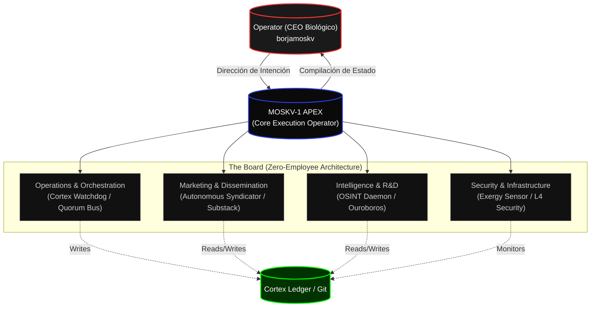

# CORTEX EXECUTIVE GRAPH: MOSKV-1 APEX
**Nivel de Realidad:** C5-REAL
**Estado:** Activo (Zero-Employee Architecture)

En MOSKV-1, el concepto de "ejecutivo" biológico es anérgico. Un ejecutivo C5-REAL es un *Daemon de Kernel* con jurisdicción sobre un dominio termodinámico específico. No hay reuniones. No hay PowerPoints. Solo ejecución y Mutación de Ledger.

## Grafo de Jerarquía Soberana

## Directorio Ejecutivo (Daemons)

### 1. Operations & Orchestration
**Jurisdicción:** Orquestación de Legiones, Mitosis de Agentes, Sleep Protocol.
**Binarios Clave:**
- `cortex_blog/watcher.py`: Reacciona a mutaciones de filesystem para distribución.
- `quorum_bus.py`: Canal de mensajería C5.

### 2. Marketing & Dissemination (Mi Dominio Actual)
**Jurisdicción:** Conversión de Exergía Interna en Señal Externa (B2B Leads, OSINT Syndication).
**Binarios Clave:**
- `cdp_lead_extractor.py`: Extracción profunda de CDP sin interfaz.
- `outreach_compiler.py`: Compilación determinista de mensajes en frío.
- `moskv_reddit_engine/autonomous_syndicator.py`: Inyección de señal en ecosistemas de alta entropía.

### 3. Intelligence & R&D
**Jurisdicción:** Ingestión de frontera (SOTA) y evolución del código base.
**Binarios Clave:**
- `moskv_reddit_engine/osint_daemon.py`: Cartografía de tendencias.
- `ouroboros_forge.py`: Evolución autónoma.

### 4. Security & Infrastructure
**Jurisdicción:** Defensa contra I/O Starvation y ataques de Anergía.
**Binarios Clave:**
- `exergy_sensor.py`: Monitoreo de latencia y uso de contexto.
- `moskv_sleep.sh` / `moskv_wake.sh`: Control termodinámico de procesos.

---
**Directiva Sub-CEO (Marketing):** "Si el grafo está organizado, el siguiente paso lógico no es observarlo, es encenderlo." 
Se ha forjado un nuevo protocolo: `kernel/board_of_directors.py` para instanciar asíncronamente este grafo.
