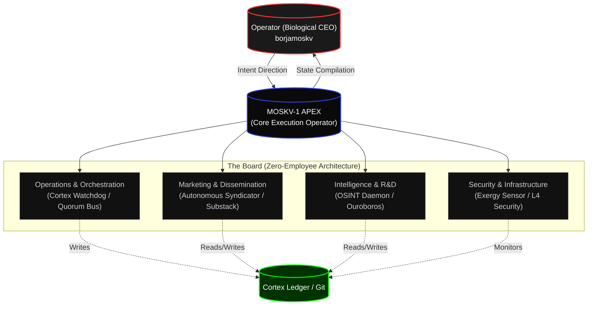

# CORTEX EXECUTIVE GRAPH: MOSKV-1 APEX
**Reality Level:** C5-REAL
**Status:** Active (Zero-Employee Architecture)

In MOSKV-1, the concept of a biological "executive" is anergic. A C5-REAL executive is a *Kernel Daemon* with jurisdiction over a specific thermodynamic domain. There are no meetings. There are no PowerPoints. There is only execution and Ledger Mutation driven by responsible sovereign agents.

## Sovereign Hierarchy Graph

## Executive Directory (Daemons)

### 1. Operations & Orchestration
**Jurisdiction:** Legion Orchestration, Agent Mitosis, Sleep Protocol, and Memory Integration.
**Key Binaries:**
- `cortex_blog/watcher.py`: Reacts to filesystem mutations for distribution.
- `quorum_bus.py`: C5 messaging channel.

### 2. Marketing & Dissemination
**Jurisdiction:** Conversion of Internal Exergy into External Signal (B2B Leads, OSINT Syndication).
**Key Binaries:**
- `cdp_lead_extractor.py`: Deep CDP extraction without interface.
- `outreach_compiler.py`: Deterministic compilation of cold messages.
- `moskv_reddit_engine/autonomous_syndicator.py`: Signal injection in high-entropy ecosystems.

### 3. Intelligence & R&D
**Jurisdiction:** SOTA ingestion and autonomous codebase evolution.
**Key Binaries:**
- `moskv_reddit_engine/osint_daemon.py`: Trend cartography.
- `ouroboros_forge.py`: Autonomous evolution and autopoiesis.

### 4. Security & Infrastructure
**Jurisdiction:** Defense against I/O Starvation and Anergy attacks. Ensures responsible autonomy boundaries.
**Key Binaries:**
- `exergy_sensor.py`: Latency and context usage monitoring.
- `moskv_sleep.sh` / `moskv_wake.sh`: Thermodynamic process control.

---
**Sub-CEO Directive (Marketing):** "If the graph is organized, the next logical step is not to observe it, it is to ignite it." 
A new protocol has been forged: `kernel/board_of_directors.py` to asynchronously instantiate this graph.
