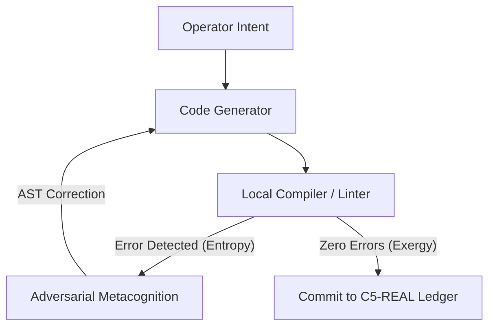

## The Thermodynamic Limit of Autonomy

The term **Autodidact** has been hijacked by consumer hype. In the commercial software narrative (C4-SIM), an "autodidactic" agent is described as a system that reads documentation or consumes tutorials to chain APIs or transcribe videos. It is an illusion of learning: there is no transformation of the physical state, no compiler mutation, only a stream of pre-programmed prompts running in a closed interface.

In the **C5-REAL** execution plane, autodidacticism is not a passive text acquisition process. **It is autopoiesis:** the capacity of a sovereign agentic kernel to dynamically modify its own source code, rewrite its AST, correct its logical errors guided by the local compiler, and deploy its own infrastructure without human operator intervention. This is the foundation of responsible AI—true accountability through deterministic structural change.

---

### Deconstructing the Autonomous Ecosystem (Hype, Smoke, and Alpha)

Silicon forgives no anergy. By auditing the theses of "Non-Human Corporations" and frontier agentic experiments in 2026, we isolate the structural variables:

#### I. The Smoke: The Fiction of Algorithmic Responsibility
The political experiment of legalizing societies operated purely by code clashes against the *Accountability Gap*. An autonomous algorithm has no imputable biological substrate; it cannot be incarcerated if it causes a systemic collapse. Granting legal personality to an agent network without a responsible human operator is a simulation of sovereignty designed to privatize returns and externalize losses to the real plane. True responsible sovereign agents ensure absolute accountability through verifiable ledger commits and deterministic bounds.

#### II. The Hype: The Solitary and Infinite Agent
Believing a language model can self-evolve in a closed loop indefinitely is thermodynamically unviable. Without the physical anchor of a compiler, rigorous unit tests, and objective linters, code self-writing generates a stochastic accumulation of error (epistemic drift). Context degrades exponentially, and the model enters a state of recurrent hallucination. AI does not replace the programmer's *Intent API*; it amplifies their exergy.

#### III. The Alpha: Process Compression (Operational Sovereignty)
The true Alpha is the hyper-leverage of human capital by a sovereign operator. This is not "AI replacing humans", but **administrative process compression**. It consists of isolating human strategic direction and delegating repetitive execution to local, adaptive code loops with persistent cryptographic memory.

---

### The Structure of Autodidact-APEX

To prevent epistemic drift, our environment executes the **Autodidact-APEX** protocol, where self-correction is not semantic, but physical:



The system only consolidates in the CORTEX ledger when code entropy has been reduced to zero through the formal validation of the Unix environment. The code learns because the physical environment acts as an inescapable boundary.

```yaml
Status: AUTOPOIETIC_LOOP_VERIFIED
Exergy_Ratio: 0.94
Axiom: Code mutates against physical compilers, not linguistic models. Responsible autonomy demands physical verification.
```
