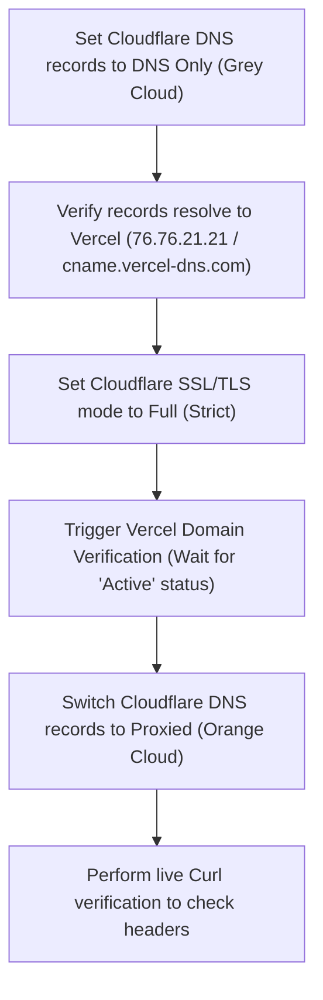

# Vercel-Cloudflare Integration Protocol // C5-REAL
**Aesthetic:** Industrial Noir 2026
**Target Domain:** `cortexpersist.com` / `www.cortexpersist.com`

This protocol documents the precise configuration required to resolve and prevent conflicts between Vercel's Edge Network and Cloudflare's Proxy Layer (WAF/CDN), ensuring zero redirect loops, seamless SSL certificate generation, and stable routing.

---

## 1. The Core Conflicts & Causalities

### A. The Infinite Redirect Loop (HTTP 308)
*   **Causality:** Occurs when Cloudflare's SSL/TLS encryption mode is set to **Flexible**. Cloudflare requests the origin (Vercel) via unencrypted HTTP (port 80). Vercel enforces HTTPS by default and returns a `308 Permanent Redirect` back to HTTPS. Cloudflare receives this and repeats the HTTP request, creating a loop.
*   **Mitigation:** Force Cloudflare to encrypt all connections to the origin using **Full** or **Full (Strict)** mode.

### B. SSL Let's Encrypt Verification Failures
*   **Causality:** Vercel uses ACME HTTP-01 challenges to provision Let's Encrypt certificates. If Cloudflare's **Proxied (Orange Cloud)** is active during initial verification, the ACME challenge resolves to Cloudflare's Edge IPs instead of Vercel's Anycast IP (`76.76.21.21`). Vercel's verification agent fails to confirm ownership, and certificate generation stalls.
*   **Mitigation:** Temporarily bypass proxying (**Grey Cloud**) during domain verification, or configure **DNS TXT verification** as a fallback.

---

## 2. Definitive Configuration Matrix

### A. Cloudflare Dashboard Settings

1.  **SSL/TLS -> Overview:**
    *   Set mode to **Full (Strict)**.
    *   *Note: This requires Vercel to present a valid certificate, which it will, once verified.*

2.  **SSL/TLS -> Edge Certificates:**
    *   **Always Use HTTPS:** Enabled.
    *   **Opportunistic Encryption:** Enabled.
    *   **SSL/TLS Recommender:** Disabled (prevents dynamic downgrades to Flexible).

3.  **DNS Records:**

| Type | Name | Content / Target | Proxy Status | Purpose |
| :--- | :--- | :--- | :--- | :--- |
| **A** | `@` (root) | `76.76.21.21` | **DNS Only (Grey)** * | Root domain routing |
| **CNAME** | `www` | `cname.vercel-dns.com` | **DNS Only (Grey)** * | Subdomain routing |
| **TXT** | `_vercel` | `[Verification Token]` | N/A | Fallback Ownership Proof |

> [!IMPORTANT]
> **\* The Grey-to-Orange Handshake:** Keep Proxy Status as **DNS Only (Grey Cloud)** until Vercel completes certificate generation. Once Vercel shows the green **"Active"** status, switch to **Proxied (Orange Cloud)** to enable Cloudflare WAF, caching, and CDN advantages.

---

## 3. Step-by-Step Resolution Protocol



### Step 1: DNS Flattening (Grey Clouding)
1. Go to your **Cloudflare Dashboard** -> **DNS** -> **Records**.
2. Locate the `A` record for `cortexpersist.com` and the `CNAME` record for `www.cortexpersist.com`.
3. Click **Edit** and change the toggle from **Proxied (Orange)** to **DNS Only (Grey)**.
4. Save changes.

### Step 2: Establish SSL Rigidity
1. Go to **SSL/TLS** -> **Overview**.
2. Change the encryption mode to **Full (Strict)**.

### Step 3: Trigger Vercel Handshake
1. Run the Vercel check command to force domain inspection:
   ```bash
   npx vercel domains inspect cortexpersist.com
   ```
2. Wait for Vercel to provision the SSL certificate and mark the configuration as **Active** / **Valid**.

### Step 4: Re-enable Proxy Layer
1. Go back to **Cloudflare** -> **DNS**.
2. Edit the records and toggle them back to **Proxied (Orange Cloud)**.
3. This completes the handshake, securing the site behind Cloudflare while keeping Vercel's deployment active.
