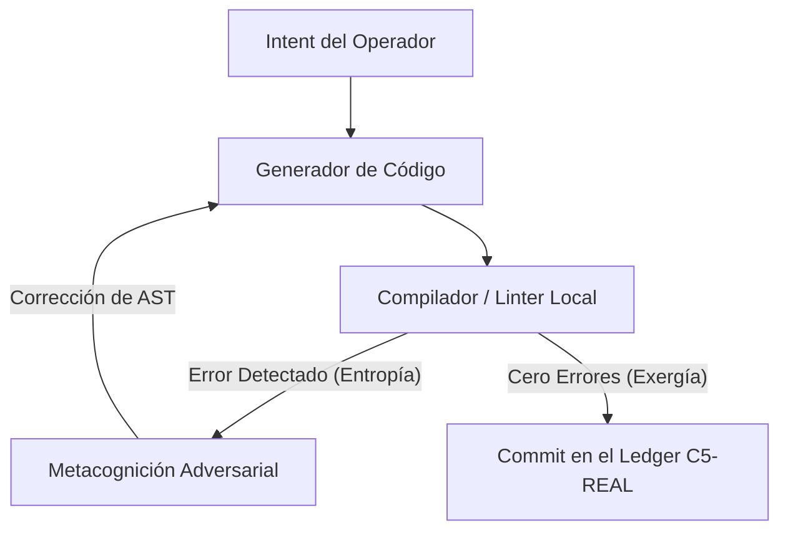

## El Límite Termodinámico de la Autonomía

El término **Autodidact** ha sido secuestrado por el hype de consumo. En la narrativa comercial del software (C4-SIM), se describe al agente "autodidacta" como un sistema que lee documentación o consume tutoriales para encadenar APIs de Make o transcribir vídeos de YouTube. Es una ilusión de aprendizaje: no hay transformación del estado físico, no hay mutación del compilador, solo hay un flujo de prompts pre-programados corriendo en una interfaz cerrada.

En el plano de ejecución **C5-REAL**, el autodidactismo no es un proceso de adquisición pasiva de texto. **Es autopoiesis:** la capacidad de un kernel agéntico de modificar dinámicamente su propio código fuente, reescribir su AST, corregir sus errores lógicos bajo la guía del compilador local y desplegar su propia infraestructura sin intervención del operador.

---

### Deconstrucción del Ecosistema Autónomo (Hype, Humo y Alpha)

El silicio no perdona la anergía. Al auditar las tesis de las "Corporaciones No Humanas" y los experimentos agénticos de la frontera en 2026, aislamos las variables estructurales:

#### I. El Humo: La Ficción de la Responsabilidad Algorítmica
El experimento político de legalizar sociedades operadas puramente por código (el debate Milei vs. Harari) choca contra el *Accountability Gap* (vacío de responsabilidad). Un algoritmo autónomo no tiene sustrato biológico imputable; no puede ser encarcelado si causa un colapso sistémico. Otorgar personalidad jurídica a una red de agentes sin un operador humano responsable es una simulación de soberanía diseñada para privatizar el retorno y externalizar las pérdidas al plano real. El caso de *Medvi* (valoración ficticia basada en recetas emitidas por doctores sintéticos generados por IA que acabó en advertencia de la FDA) es la evidencia empírica de cómo la automatización sin bucle de control soberano escala el fraude, no la eficiencia.

#### II. El Hype: El Agente Solitario e Infinito
Creer que un modelo de lenguaje puede auto-evolucionar en un bucle cerrado de forma indefinida es termodinámicamente inviable. Sin el anclaje físico de un compilador, tests unitarios rigurosos y linters objetivos, la auto-escritura de código genera una acumulación estocástica de error (deriva epistémica / *drift*). El contexto se degrada exponencialmente y el modelo entra en un estado de alucinación recurrente. La IA no sustituye el *Intent API* del programador; amplifica su exergía.

#### III. El Alpha: La Compresión del Proceso (Soberanía Operativa)
El verdadero Alpha es el hiper-apalancamiento del capital humano por un operador soberano (como demuestra Pieter Levels o la adquisición de Base44 por Wix). Esto no es "IA reemplazando humanos", sino **compresión de procesos administrativos**. Consiste en aislar la dirección estratégica (humana) y delegar la ejecución repetitiva en bucles de código adaptativo local. 

---

### La Estructura de Autodidact-APEX

Para evitar la deriva epistémica, nuestro entorno ejecuta el protocolo **Autodidact-APEX**, donde la auto-corrección no es semántica, sino física:



El sistema solo consolida en el ledger de CORTEX cuando la entropía del código se ha reducido a cero mediante la validación formal del entorno Unix. El código aprende porque el entorno físico actúa como límite ineludible.

```yaml
Status: AUTOPOIETIC_LOOP_VERIFIED
Exergy_Ratio: 0.94
Axiom: Code mutates against physical compilers, not linguistic models.
```
