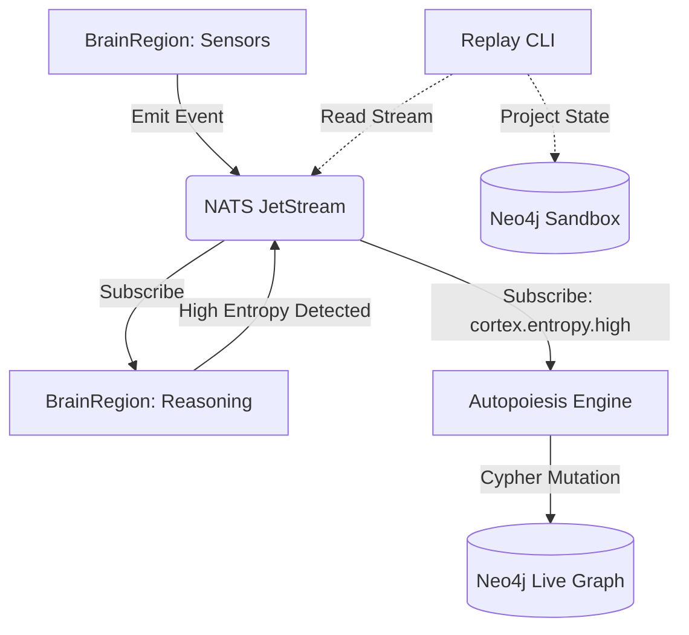

# CORTEX-PERSIST — C5-REAL Architecture (v10.0)

> **Status:** LIVE ORGANISM
> **Topology:** Distributed Cognitive OS + Self-Modifying Graph
> **Reality Level:** C5-REAL

## 1. Core Topography

The system abandons the static schematic model to become a sovereign, autopoietic organism. It relies on three primary substrates:

1. **Neural Memory (Neo4j):** A live graph database mapping semantic and structural relationships.
2. **Event Stream (NATS JetStream):** High-frequency nervous system handling distributed messages and stream replay.
3. **Execution Swarm (Node.js):** Isolated `BrainRegion` workers operating concurrently.

---

## 2. Distributed Event Bus (The Nervous System)

- **Technology:** `@nats-io/transport-node` (JetStream).
- **Purpose:** Replaces the legacy `EventEmitter` with a distributed, durable stream.
- **Hash-Chained Ledger:** Every event payload incorporates a SHA-256 hash of the `(prevHash + payload)`. This creates a C5-REAL verifiable, immutable timeline of cognition.
- **Implementation:** `kernel/event-bus.js`.

---

## 3. Autopoiesis Engine (Self-Modifying Graph)

- **Technology:** `neo4j-driver` + Node.js Worker.
- **Trigger:** Event-driven. The engine listens to the NATS subject `cortex.entropy.high`.
- **Action:** Upon receiving high exergy signals, the engine autonomously executes Cypher queries to restructure the Neo4j graph (creating, purging, or relinking nodes).
- **Implementation:** `kernel/autopoiesis.js`.

---

## 4. Swarm Topology (CEN Cluster)

- **Architecture:** Decoupled `BrainRegion` classes running as separate Node.js processes or Worker Threads.
- **Isolation:** Each region connects to NATS independently, maintaining an isolated execution context.
- **Scaling:** Operates as a true swarm. Regions like `Vision`, `Reasoning`, and `Motor` can scale horizontally.
- **Implementation:** `kernel/brain-region.js`.

---

## 5. Conscious Replay (State Reconstruction)

- **Mechanics:** A CLI interface to rebuild historical cognitive states without mutating the active graph.
- **Sandbox Projection:** The system reads the hash-chained NATS stream from a specific `fromHash` to a `toHash`. It applies these mutations to a separate, isolated Neo4j Sandbox.
- **Implementation:** `kernel/replay.js`.

---

## 6. Execution Flow (C5-REAL Ledger)

*Document generated via Ouroboros Exergy-Maximized Protocol.*

---

## 7. Canary Swarm Economy & Active Guardrails

- **Ecosystem Topology:** Multi-archetype code competition under delayed economic pressure.
- **Canary Routing & Deployer (`kernel/canary/`):** Spawns isolated Vercel deployments mapped to `cortex/<archetype>/<hash>` branches. Split-traffic is controlled by the router setting `x-cortex-mode: canary` and assignation parameters.
- **Fitness Evaluation (`kernel/canary/fitness_buffer.js`):** Transacts payments over a rolling 24-hour historical window instead of instant webhook response evaluation.
- **Bandit Allocator (`kernel/swarm/allocator.js`):** Computes exploitation vs exploration ratio using a standard Upper Confidence Bound (UCB) equation based on actual revenue rewards and execution frequencies.
- **Active Guardrails (`kernel/guardrails/`):** The `Sentinel` acts as a circuit breaker. It intercepts the Cron sweep and instantly purges any branch that breaches the latency tolerance of its archetype or causes HTTP error rates $> 1\%$.
