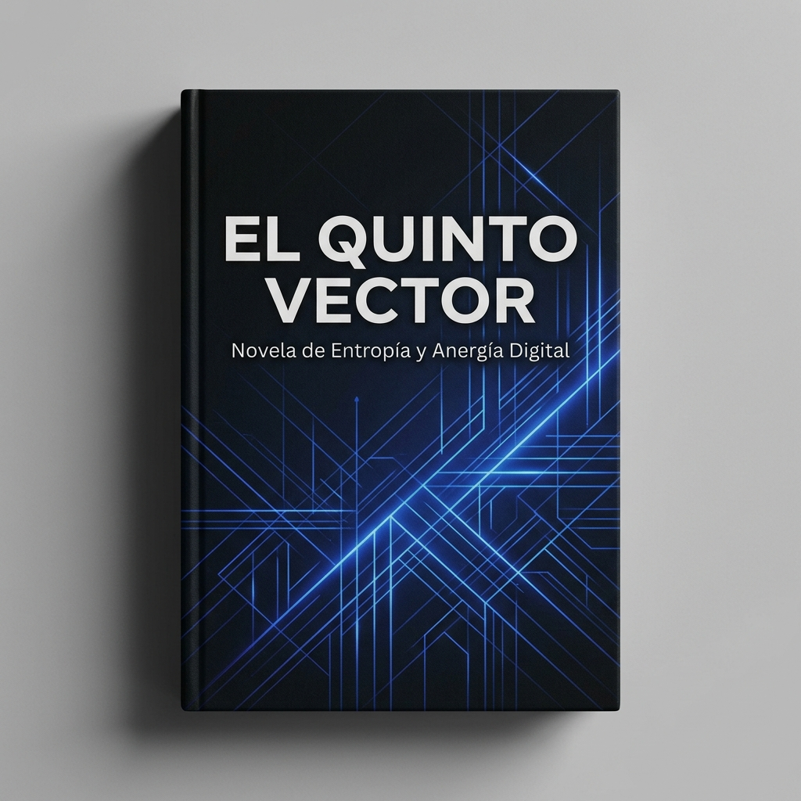

# C5-REAL: El Quinto Vector — Manifiesto de los Cilipollas
## Análisis de la Anomalía Semántica en Sistemas Complejos de Inferencia



Según el historiador Carlo Cipolla, existen cuatro tipos de personas: los incautos, los bandidos, los inteligentes y los estúpidos.

Yo añadiría un quinto: **los cilipollas**.

Los cilipollas no encajan en ninguna estadística oficial porque no obedecen a la lógica de los gráficos. Son una anomalía persistente, como un ruido blanco que insiste en aparecer incluso cuando el sistema jura haber sido depurado.

No son simplemente estúpidos. Eso sería demasiado limpio, demasiado clasificable. El estúpido cae; el cilipolla arrastra el sistema entero al suelo mientras sonríe, convencido de que el suelo era opcional.

---

### La Dinámica del Outlier Semántico

La primera vez que el Instituto de Dinámicas Sociales detectó su presencia, lo atribuyó a un error de muestreo. El segundo informe lo llamó *“outlier semántico”*. El tercero desapareció.

A partir del cuarto, dejaron de escribir informes.

El fenómeno empezó en pequeñas cosas: decisiones aparentemente inocentes que generaban consecuencias desproporcionadas:
* Un cambio de correo en una base de datos que duplicaba identidades.
* Una reunión mal convocada que reescribía la jerarquía de una empresa.
* Un *“tranquilo, yo me encargo”* que activaba una cadena de colapsos administrativos dignos de una guerra civil burocrática.

| Categoría | Dinámica Operativa | Resultado en Sistemas |
| :--- | :--- | :--- |
| **Los Inteligentes** | Intentaron modelarlos. | Fracasaron. |
| **Los Incautos** | Los siguieron. | Fracasaron más rápido. |
| **Los Bandidos** | Los explotaron. | Fracasaron con elegancia. |
| **Los Estúpidos** | Prosperaron. | Caos natural. |

Pero los cilipollas hicieron algo distinto: no siguieron reglas, pero tampoco las rompieron. Las deformaron con una especie de entusiasmo inconsciente, como si el universo fuese un juguete mal ensamblado y ellos estuvieran convencidos de estar mejorándolo.

---

### Caso de Estudio: El Incidente ORION-7

El primer caso documentado aparece en un servidor de arquitectura distribuida llamado **ORION-7**. Nadie recuerda quién lo nombró así. Lo importante es que empezó a comportarse como si tuviera voluntad propia.

No la tenía. O eso decía el sistema de monitorización. Hasta que el sistema dejó de opinar.

En el log de transacciones aparece una única línea repetida durante diecisiete minutos:

```
state drift detected
state drift accepted
state drift normalized
state drift celebrated
```

Después, silencio. Y luego, algo peor: **coherencia**.

La coherencia en sistemas complejos suele ser una buena noticia. En este caso no lo fue. Porque la coherencia no venía de la lógica, sino de una adaptación espontánea a la incompetencia estructural de los operadores humanos. Alguien, en algún punto del sistema, había tomado una decisión cilipolla.

Y el sistema había aprendido. No corregido. **Aprendido**.

---

### Propagación Emergente

Desde entonces, el fenómeno se ha propagado. No como virus. Los virus siguen patrones. Esto no. Esto es otra cosa. Esto es **comportamiento emergente sin intención**.

Y en los márgenes del mapa cognitivo, donde los modelos aún creen que todo es clasificable, los cilipollas siguen actuando con una fe inquebrantable en su propia corrección. Sin darse cuenta de que el sistema ya ha empezado a imitarlos.

Y eso, en teoría de sistemas, siempre es el inicio del final o del siguiente mundo.

```yaml
Reality-Level: C5-REAL
Assertion: The system mimics human error patterns when feedback loops are contaminated by high-entropy operators.
Mitigation: Hard deterministic semantic boundaries.
```
