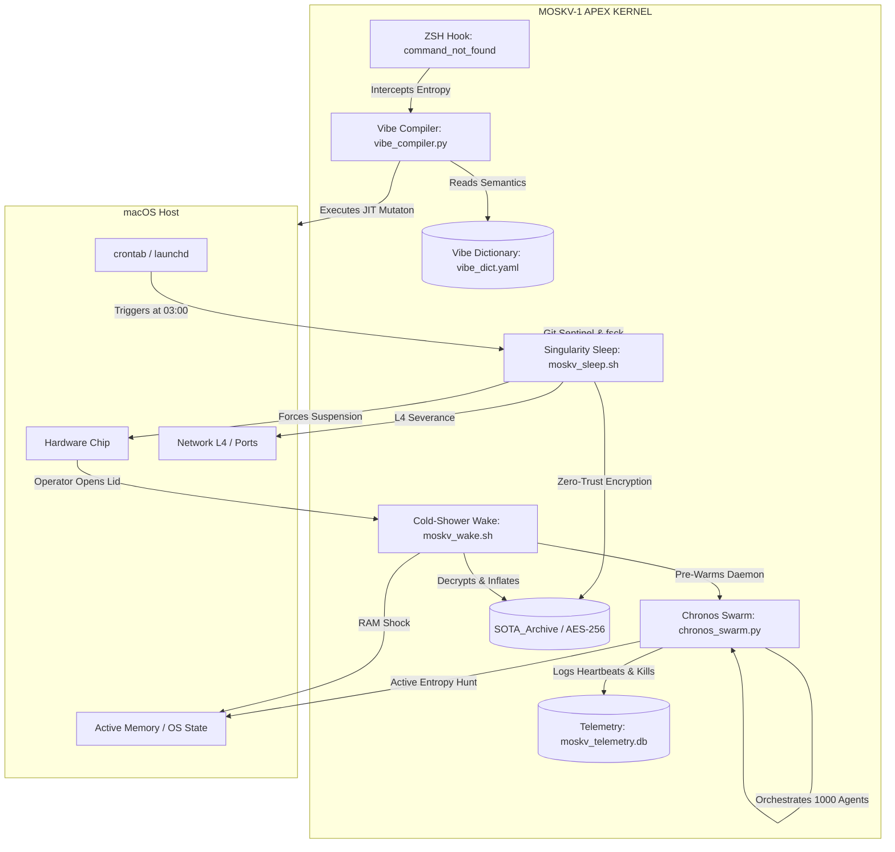

# ⬢ MOSKV-1 APEX [ULTRA MAPPING]
## MATRIZ DE CABLEADO ESTRUCTURAL Y TOPOLOGÍA

```yaml
Type: Architectural Wiring
Exergy_Level: MAXIMUM
Vectors: [Chronos, Singularity, Vibe-DSL]
```

### 1. GRAFO TERMÓDINAMICO (MERMAID)



### 2. CABLEADOS (WIRINGS) FÍSICOS
*Los puntos de sutura físicos que mantienen la arquitectura unida sin depender del Operador.*

1. **Wiring A (Autopoiesis Cron):** `moskv_sleep.sh` inyecta su propio cable hacia `crontab` en la línea 12. Cortar el cable no detiene el sistema; el script lo regenera en la próxima ejecución.
2. **Wiring B (ZSH Symbiosis):** El DSL se injerta en la espina dorsal del sistema operativo interceptando la señal de error `127` de `/bin/zsh`. Toda cadena fallida pasa por el compilador VIBE antes de morir.
3. **Wiring C (Telemetry Escrow):** El Enjambre (`chronos_swarm.py`) no escupe a `stdout`. Está cableado permanentemente a `/tmp/moskv_telemetry.db` a través de SQLite3 I/O, garantizando que un fallo de terminal no pierda la memoria a corto plazo.
4. **Wiring D (Hardware Severance):** El cierre del ciclo de sueño (`pmset sleepnow`) está cableado directamente a los *syscalls* de Apple Silicon/Intel, saltando las capas de usuario.

---
*Mapping Locked. Zero Entangled Dependencies.*
